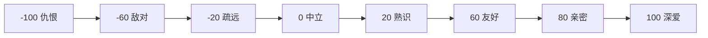
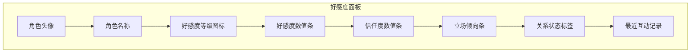
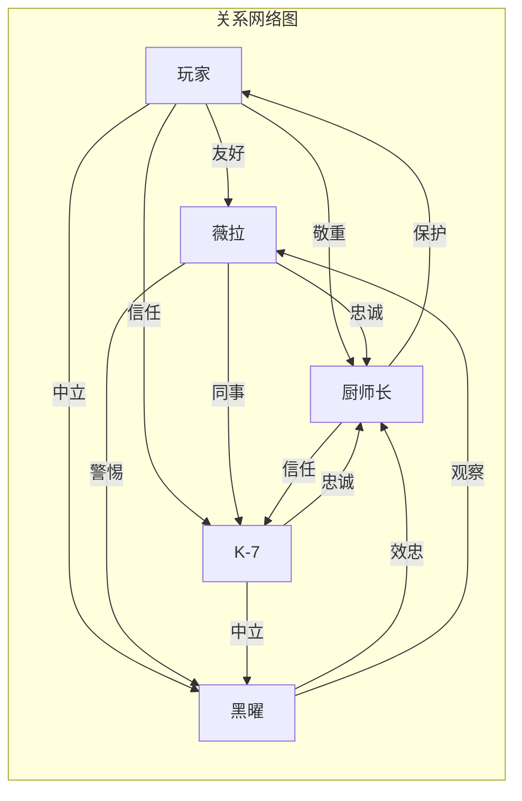

# 角色好感度系统设计方案

## 1. 系统概述

基于现有的世界书系统，扩展一个完整的角色好感度系统，用于追踪玩家与各角色的关系变化，并通过可视化界面展示，同时影响剧情走向和触发特殊事件。

### 现有基础

系统已有以下基础设施：

- **关系数据结构** (`relationshipBase`)：
  - `favor`: 好感度 (-100 ~ 100)
  - `trust`: 信任度 (-100 ~ 100)
  - `stance`: 立场倾向 (-100 ~ 100，负值敌对，正值友好)

- **导演器系统**：可基于关系条件触发事件
- **关系变更记录** (`relationshipLedger`)：记录每次关系变化
- **Prompt集成**：关系快照已注入到LLM生成prompt中

## 2. 新增功能模块

### 2.1 好感度等级系统

将数值映射为可视化的等级和状态：



**等级定义表**：

| 等级 | 范围 | 名称 | 颜色 | 描述 |
|------|------|------|------|------|
| 8 | 90-100 | 深爱 | #ff4d4d | 无法分离的羁绊 |
| 7 | 70-89 | 亲密 | #ff6b6b | 可以托付生命 |
| 6 | 50-69 | 友好 | #ffa500 | 互相信任的朋友 |
| 5 | 30-49 | 熟识 | #87ceeb | 开始了解彼此 |
| 4 | 10-29 | 初识 | #c0c0c0 | 刚刚认识 |
| 3 | -9~9 | 中立 | #808080 | 没有特别印象 |
| 2 | -29~-10 | 疏远 | #4a4a4a | 有些距离感 |
| 1 | -59~-30 | 敌对 | #8b0000 | 明显的敌意 |
| 0 | -100~-60 | 仇恨 | #2d0000 | 不死不休 |

### 2.2 好感度变化动画

当好感度发生变化时，显示动态反馈：

- **上升动画**：心形图标上升 + 粉色光效 + 数值跳动
- **下降动画**：心形破碎 + 红色阴影 + 数值下降
- **变化幅度提示**：
  - 小幅变化 (±1~5): 微弱提示
  - 中幅变化 (±6~15): 明显提示
  - 大幅变化 (±16+): 强烈提示 + 特殊音效

### 2.3 好感度面板界面

新增一个可随时查看的好感度面板：



**界面元素**：

1. **角色列表**：显示所有已建立关系的角色
2. **详细面板**：点击角色显示完整关系数据
3. **历史记录**：显示最近10次关系变化
4. **里程碑标记**：特殊关系事件的时间点

### 2.4 好感度事件系统

扩展导演器系统，支持好感度触发的事件：

**事件类型**：

| 类型 | 触发条件 | 效果 |
|------|----------|------|
| 阈值事件 | 好感度达到特定值 | 解锁特殊对话/场景 |
| 变化事件 | 好感度变化超过阈值 | 触发即时反应 |
| 组合事件 | 多角色好感度满足条件 | 触发复合剧情 |
| 冲突事件 | 两个角色好感度差距过大 | 触发矛盾剧情 |

**示例配置**：

```json
{
  "id": "event_vera_confession",
  "name": "薇拉的告白",
  "trigger": {
    "type": "threshold",
    "characterId": "char_fork_cake_2",
    "metric": "favor",
    "value": 80,
    "direction": "up"
  },
  "content": {
    "promptHint": "薇拉决定向你坦白她的真实身份...",
    "unlockDialogue": ["special_vera_confession"]
  }
}
```

### 2.5 好感度影响剧情

通过LLM Prompt注入，让AI根据好感度调整对话风格：

**Prompt模板扩展**：

```
【角色关系状态】
- 薇拉 (好感度: 75/亲密): 她开始对你产生真正的感情，但内心仍有身份矛盾的挣扎
- K-7 (好感度: 45/友好): 把你当作值得保护的新人，经常提供额外情报
- 黑曜 (好感度: -15/疏远): 对你保持警惕，观察你是否值得信任

【关系影响提示】
根据当前好感度，薇拉的对话应该表现出：
- 语气更加温柔但带有隐秘的担忧
- 会主动提供帮助但避免谈及敏感话题
- 在关键时刻会犹豫是否要透露真相
```

## 3. 技术实现方案

### 3.1 文件结构

```
src/
├── relationship/
│   ├── relationshipStore.js      # 好感度数据管理
│   ├── relationshipLevels.js     # 等级定义和计算
│   ├── relationshipEvents.js     # 好感度事件处理
│   └── relationshipAnimator.js   # 变化动画控制
├── components/
│   └── RelationshipPanel.vue     # 好感度面板组件
│   └── RelationshipIndicator.vue # 单角色好感度指示器
│   └── RelationshipChangeToast.vue # 变化提示组件
├── screens/
│   └ RelationshipScreen.vue      # 好感度详情页面
```

### 3.2 数据结构扩展

**扩展存档数据**：

```javascript
// saveManager.js 扩展
const createEmptySaveData = () => ({
  // ... 现有字段
  relationships: {
    // 运行时关系状态（覆盖世界书默认值）
    runtime: {
      "char_fork_cake_1": {
        favor: 55,
        trust: 40,
        stance: 20,
        lastUpdated: "2026-04-08T12:00:00Z"
      }
    },
    // 关系变化历史
    history: [
      {
        timestamp: "2026-04-08T11:30:00Z",
        characterId: "char_fork_cake_2",
        changes: { favor: +5, trust: +2 },
        reason: "帮助薇拉完成危险甜点",
        dialogueIndex: 45
      }
    ],
    // 已触发的关系事件
    triggeredEvents: ["event_vera_first_trust"]
  }
})
```

**世界书角色扩展**：

```javascript
// worldBookStore.js 角色结构扩展
const createCharacterSkeleton = (index = 1) => ({
  // ... 现有字段
  relationshipBase: {
    favor: 50,      // 初始好感度
    trust: 50,      // 初始信任度  
    stance: 0,      // 初始立场
  },
  relationshipMilestones: [
    {
      id: "milestone_vera_trust",
      name: "第一次信任",
      favorThreshold: 30,
      description: "薇拉开始相信你",
      rewards: ["unlock_vera_backstory"]
    }
  ],
  relationshipPersonality: {
    favorSensitivity: 1.0,   // 好感度变化敏感度
    trustDecayRate: 0.1,     // 信任度衰减速率
    stanceFlexibility: 0.5,  // 立场改变灵活性
  }
})
```

### 3.3 核心API设计

```javascript
// relationshipStore.js

/**
 * 获取角色的当前好感度状态
 */
export const getCharacterRelationship = (characterId) => {
  // 合合世界书默认值 + 运行时变更
}

/**
 * 更新角色好感度
 */
export const updateRelationship = (characterId, deltas, reason) => {
  // 记录变更 + 触发事件检查 + 动画通知
}

/**
 * 获取好感度等级信息
 */
export const getRelationshipLevel = (favorValue) => {
  // 返回等级名称、颜色、描述
}

/**
 * 检查并触发好感度事件
 */
export const checkRelationshipEvents = (characterId, oldValues, newValues) => {
  // 检查阈值事件、变化事件
}

/**
 * 获取关系状态描述（用于Prompt）
 */
export const getRelationshipPromptContext = (characterIds) => {
  // 生成用于LLM的关系描述文本
}
```

### 3.4 UI组件设计

**RelationshipPanel.vue** - 主面板：

```vue
<template>
  <div class="relationship-panel">
    <div class="panel-header">
      <h3>角色关系</h3>
      <button @click="toggleSort">排序</button>
    </div>
    
    <div class="character-list">
      <RelationshipIndicator 
        v-for="char in sortedCharacters"
        :key="char.id"
        :character="char"
        :relationship="getRelationship(char.id)"
        @click="showDetail(char.id)"
      />
    </div>
    
    <div class="history-section">
      <h4>最近变化</h4>
      <RelationshipHistoryList :history="recentHistory" />
    </div>
  </div>
</template>
```

**RelationshipIndicator.vue** - 单角色指示器：

```vue
<template>
  <div class="relationship-indicator" :class="levelClass">
    <div class="character-avatar">
      
      <div class="level-badge" :style="levelColor">
        {{ levelIcon }}
      </div>
    </div>
    
    <div class="character-info">
      <span class="name">{{ character.name }}</span>
      <span class="level-name">{{ levelName }}</span>
    </div>
    
    <div class="metrics">
      <ProgressBar 
        :value="relationship.favor" 
        :min="-100" :max="100"
        color="#ff6b6b"
        label="好感"
      />
      <ProgressBar 
        :value="relationship.trust" 
        :min="-100" :max="100"
        color="#4a90d9"
        label="信任"
      />
    </div>
  </div>
</template>
```

**RelationshipChangeToast.vue** - 变化提示：

```vue
<template>
  <Transition name="relationship-change">
    <div v-if="visible" class="change-toast" :class="changeType">
      <div class="character-mini">
        
      </div>
      <div class="change-info">
        <span class="character-name">{{ characterName }}</span>
        <div class="change-value">
          <span class="metric">{{ metricName }}</span>
          <span class="delta">{{ formattedDelta }}</span>
        </div>
        <span class="reason">{{ reason }}</span>
      </div>
      <div class="animation-layer">
        <!-- 心形上升/下降动画 -->
      </div>
    </div>
  </Transition>
</template>
```

## 4. 与现有系统集成

### 4.1 与GameScreen集成

在游戏界面添加好感度入口：

```vue
<!-- GameScreen.vue -->
<template>
  <div class="game-screen">
    <!-- 现有元素 -->
    
    <!-- 新增：好感度按钮 -->
    <button class="relationship-btn" @click="showRelationshipPanel">
      <span class="icon">💕</span>
      <span class="label">关系</span>
    </button>
    
    <!-- 新增：好感度变化提示 -->
    <RelationshipChangeToast 
      v-if="activeRelationshipChange"
      :change="activeRelationshipChange"
    />
    
    <!-- 新增：好感度面板（可折叠） -->
    <RelationshipPanel 
      v-if="relationshipPanelVisible"
      :characters="sceneCharacters"
      @close="hideRelationshipPanel"
    />
  </div>
</template>
```

### 4.2 与PromptGenerator集成

扩展prompt生成，注入关系状态：

```javascript
// promptGenerator.js 扩展

const buildRelationshipContextSection = (worldBook, sceneCharacters, runtimeRelationships) => {
  const lines = []
  lines.push('【角色关系状态】')
  
  for (const char of sceneCharacters) {
    const relationship = mergeRelationship(
      char.relationshipBase,
      runtimeRelationships?.[char.id]
    )
    const level = getRelationshipLevel(relationship.favor)
    
    lines.push(`- ${char.name} (好感度: ${relationship.favor}/${level.name}): ${getRelationshipDescription(relationship, char)}`)
  }
  
  lines.push('')
  lines.push('【关系影响提示】')
  lines.push(getRelationshipInfluenceHint(sceneCharacters, runtimeRelationships))
  
  return lines.join('\n')
}
```

### 4.3 与导演器系统集成

扩展导演器条件检查：

```javascript
// worldBookStore.js 导演器扩展

const checkDirectorEventConditions = (event, context) => {
  const { relationship } = event.condition
  
  // 检查关系条件
  for (const rule of relationship) {
    const currentRel = getCharacterRelationship(rule.characterId)
    
    if (rule.favorMin !== null && currentRel.favor < rule.favorMin) return false
    if (rule.favorMax !== null && currentRel.favor > rule.favorMax) return false
    if (rule.trustMin !== null && currentRel.trust < rule.trustMin) return false
    if (rule.trustMax !== null && currentRel.trust > rule.trustMax) return false
  }
  
  return true
}
```

### 4.4 与存档系统集成

确保好感度数据正确保存和加载：

```javascript
// saveManager.js 扩展

const saveGame = async (gameData, slotId) => {
  const saveData = {
    // ... 现有字段
    relationships: {
      runtime: gameData.relationships?.runtime || {},
      history: gameData.relationships?.history || [],
      triggeredEvents: gameData.relationships?.triggeredEvents || [],
    }
  }
  // 保存逻辑...
}

const loadGame = async (slotId) => {
  const saveData = await readSaveFile(slotId)
  return {
    // ... 现有字段
    relationships: saveData.relationships || createDefaultRelationshipData()
  }
}
```

## 5. 实现步骤

### Phase 1: 核心数据层
1. 创建 `relationshipStore.js` - 数据管理核心
2. 创建 `relationshipLevels.js` - 等级定义
3. 扩展存档数据结构

### Phase 2: UI组件
1. 创建 `RelationshipIndicator.vue` - 单角色指示器
2. 创建 `RelationshipPanel.vue` - 主面板
3. 创建 `RelationshipChangeToast.vue` - 变化提示

### Phase 3: 系统集成
1. 集成到 `GameScreen.vue`
2. 扩展 `promptGenerator.js`
3. 扩展导演器事件检查

### Phase 4: 事件系统
1. 创建 `relationshipEvents.js`
2. 实现阈值事件触发
3. 实现变化事件触发

### Phase 5: 动画和音效
1. 创建 `relationshipAnimator.js`
2. 实现变化动画
3. 添加音效支持

## 6. 配置示例

### 世界书配置示例

```json
{
  "characters": [
    {
      "id": "char_vera",
      "name": "薇拉",
      "relationshipBase": {
        "favor": 30,
        "trust": 20,
        "stance": 0
      },
      "relationshipMilestones": [
        {
          "id": "vera_first_trust",
          "name": "初次信任",
          "favorThreshold": 50,
          "description": "薇拉开始真正信任你",
          "triggeredDialogue": "vera_trust_reveal"
        },
        {
          "id": "vera_confession",
          "name": "身份坦白",
          "favorThreshold": 80,
          "description": "薇拉向你坦白她是暗影议会的特工",
          "triggeredDialogue": "vera_identity_confession"
        }
      ],
      "relationshipPersonality": {
        "favorSensitivity": 1.2,
        "trustDecayRate": 0.05,
        "stanceFlexibility": 0.8
      }
    }
  ],
  "directorEvents": [
    {
      "id": "vera_conflict_with_k7",
      "name": "薇拉与K-7的矛盾",
      "condition": {
        "relationship": [
          {
            "characterId": "char_vera",
            "favorMin": 60
          },
          {
            "characterId": "char_k7",
            "favorMax": 20
          }
        ]
      },
      "effects": {
        "promptHint": "薇拉注意到K-7对你的态度冷淡，她开始质疑K-7的动机..."
      }
    }
  ]
}
```

## 7. 角色间关系网络可视化

### 7.1 功能概述

除了玩家与角色的关系，系统还将追踪和可视化角色之间的关系网络，帮助玩家理解复杂的角色互动和势力结构。

### 7.2 数据结构

**角色间关系数据**：

```javascript
// 世界书扩展 - 角色间关系
const characterInterRelations = {
  // 关系矩阵：角色A对角色B的关系
  "char_vera": {
    "char_k7": {
      favor: 35,        // 薇拉对K-7的好感
      trust: 60,        // 薇拉对K-7的信任
      stance: 10,       // 薇拉对K-7的立场倾向
      relationshipType: "colleague",  // 关系类型
      description: "同事关系，薇拉认为K-7是可靠的伙伴"
    },
    "char_chef": {
      favor: 70,
      trust: 85,
      stance: 50,
      relationshipType: "loyal",
      description: "薇拉对厨师长忠诚，但内心有矛盾"
    },
    "char_obsidian": {
      favor: -20,
      trust: 10,
      stance: -30,
      relationshipType: "hostile",
      description: "薇拉对黑曜保持警惕，担心身份暴露"
    }
  }
}

// 关系类型定义
const RELATIONSHIP_TYPES = {
  "family": { label: "家人", color: "#ff6b6b", icon: "👨‍👩‍👧" },
  "lover": { label: "恋人", color: "#ff4d4d", icon: "💕" },
  "friend": { label: "朋友", color: "#4a90d9", icon: "🤝" },
  "colleague": { label: "同事", color: "#87ceeb", icon: "💼" },
  "ally": { label: "盟友", color: "#2ecc71", icon: "⚔️" },
  "neutral": { label: "中立", color: "#808080", icon: "➖" },
  "rival": { label: "对手", color: "#e74c3c", icon: "🎯" },
  "hostile": { label: "敌对", color: "#8b0000", icon: "⚡" },
  "unknown": { label: "未知", color: "#c0c0c0", icon: "❓" }
}
```

### 7.3 关系网络图可视化

使用力导向图展示角色关系网络：



**可视化特性**：

1. **节点设计**：
   - 角色头像作为节点
   - 节点大小反映角色重要性
   - 节点颜色反映势力归属

2. **连线设计**：
   - 线条颜色反映关系类型
   - 线条粗细反映关系强度
   - 线条样式反映关系稳定性

3. **交互功能**：
   - 点击节点查看角色详情
   - 点击连线查看关系描述
   - 拖拽节点调整布局
   - 悬停显示关系数值

4. **筛选功能**：
   - 按势力筛选角色
   - 按关系类型筛选连线
   - 按好感度范围筛选

### 7.4 网络图组件设计

**RelationshipNetworkGraph.vue**：

```vue
<template>
  <div class="relationship-network">
    <div class="network-header">
      <h3>角色关系网络</h3>
      <div class="filters">
        <select v-model="selectedFaction">
          <option value="all">全部势力</option>
          <option v-for="f in factions" :value="f.id">{{ f.name }}</option>
        </select>
        <select v-model="selectedRelationType">
          <option value="all">全部关系</option>
          <option v-for="t in relationTypes" :value="t.id">{{ t.label }}</option>
        </select>
      </div>
    </div>
    
    <div class="network-canvas" ref="canvasContainer">
      <svg ref="networkSvg" :width="canvasWidth" :height="canvasHeight">
        <!-- 连线层 -->
        <g class="links">
          <line
            v-for="link in filteredLinks"
            :key="link.id"
            :x1="link.source.x" :y1="link.source.y"
            :x2="link.target.x" :y2="link.target.y"
            :stroke="link.color"
            :stroke-width="link.strength"
            @click="showLinkDetail(link)"
          />
        </g>
        
        <!-- 节点层 -->
        <g class="nodes">
          <g
            v-for="node in filteredNodes"
            :key="node.id"
            :transform="translate node.x node.y"
            @click="showNodeDetail(node)"
          >
            <circle
              :r="node.size"
              :fill="node.factionColor"
              :stroke="node.strokeColor"
            />
            <image
              :href="node.avatar"
              :x="-20" :y="-20"
              :width="40" :height="40"
            />
            <text :y="node.size + 15">{{ node.name }}</text>
          </g>
        </g>
      </svg>
    </div>
    
    <!-- 详情弹窗 -->
    <div v-if="selectedNode" class="node-detail-popup">
      <CharacterDetailCard :character="selectedNode" />
    </div>
    
    <div v-if="selectedLink" class="link-detail-popup">
      <RelationshipDetailCard :relationship="selectedLink" />
    </div>
  </div>
</template>
```

### 7.5 关系网络动态更新

当角色间关系发生变化时，网络图实时更新：

```javascript
// relationshipNetworkStore.js

/**
 * 更新角色间关系
 */
export const updateInterRelation = (charAId, charBId, deltas, reason) => {
  const relation = getInterRelation(charAId, charBId)
  const newRelation = {
    ...relation,
    favor: clampValue(relation.favor + deltas.favor),
    trust: clampValue(relation.trust + deltas.trust),
    stance: clampValue(relation.stance + deltas.stance),
  }
  
  // 更新关系类型（基于数值自动判断）
  newRelation.relationshipType = determineRelationshipType(newRelation)
  
  // 记录变化历史
  recordInterRelationChange(charAId, charBId, deltas, reason)
  
  // 触发网络图更新事件
  emitNetworkUpdateEvent()
}

/**
 * 根据数值判断关系类型
 */
const determineRelationshipType = (relation) => {
  if (relation.favor >= 80) return 'lover'
  if (relation.favor >= 60) return 'friend'
  if (relation.favor >= 30) return 'colleague'
  if (relation.favor >= 10) return 'neutral'
  if (relation.favor >= -20) return 'rival'
  return 'hostile'
}
```

### 7.6 关系网络对剧情的影响

角色间关系网络可以触发复杂的剧情事件：

```javascript
// 示例：三角关系冲突事件
const triangleConflictEvent = {
  id: "triangle_vera_k7_player",
  name: "薇拉与K-7的竞争",
  trigger: {
    type: "inter_relation",
    conditions: [
      { charA: "char_vera", charB: "player", favorMin: 70 },
      { charA: "char_k7", charB: "player", favorMin: 60 },
      { charA: "char_vera", charB: "char_k7", favorMax: 30 }
    ]
  },
  effects: {
    promptHint: "薇拉注意到K-7也对你表现出关心，她开始感到一丝竞争的压力...",
    interRelationDeltas: [
      { charA: "char_vera", charB: "char_k7", favor: -5 }
    ]
  }
}
```

### 7.7 技术实现方案

**新增文件**：

```
src/
├── relationship/
│   ├── relationshipNetworkStore.js   # 角色间关系数据管理
│   ├── relationshipNetworkGraph.js   # 网络图绘制算法
│   └── relationshipTypes.js          # 关系类型定义
├── components/
│   └ RelationshipNetworkGraph.vue    # 网络图组件
│   └ RelationshipNetworkFilter.vue   # 筛选控制组件
│   └ CharacterDetailCard.vue         # 角色详情卡片
│   └ RelationshipDetailCard.vue      # 关系详情卡片
```

**依赖库选择**：

- **方案A**: 使用 D3.js (d3-force) - 功能强大，但体积较大
- **方案B**: 使用 Canvas 2D 自实现 - 轻量，可控性强
- **方案C**: 使用 Vue 纯SVG实现 - 最简单，适合小型网络

推荐方案B（Canvas自实现），避免引入大型依赖。

## 8. 后续扩展方向

1. **好感度成就系统**：解锁特定关系状态获得成就徽章
2. **关系回溯功能**：查看任意时间点的关系状态
3. **好感度预测**：基于当前趋势预测未来关系走向
4. **关系冲突系统**：当两个角色好感度差距过大时触发冲突剧情
5. **势力关系图**：展示势力间的关系而非角色间