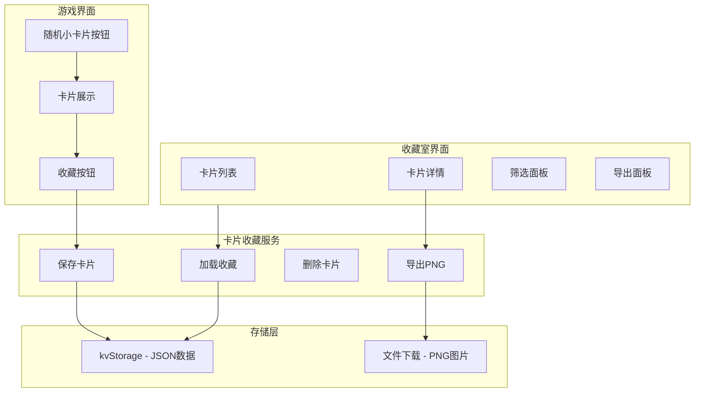

# 卡片收藏室功能设计方案

## 一、功能概述

为随机小卡片功能添加收藏系统，允许玩家保存、浏览、管理和分享生成的卡片。

## 二、技术方案

### 2.1 存储方案（混合方案）

**核心存储：JSON 数据**
- 使用现有的 `kvStorage` 存储卡片元数据和内容
- 存储键：`card_collection`
- 数据量小，便于管理和检索

**可选导出：PNG 图片**
- 使用 `html2canvas` 库将卡片 HTML 渲染为图片
- 提供单张导出和批量导出功能
- 支持下载到本地或分享（移动端）

### 2.2 数据结构设计

```json
{
  "collectionId": "card_20260407_001",
  "cardTemplateId": "note-sticky",
  "cardName": "便签",
  "category": "note",
  "categoryName": "便签",
  "categoryIcon": "📝",
  "rarity": "rare",
  "rarityName": "稀有",
  "rarityColor": "#9b59b6",
  "content": {
    "title": "重要提醒",
    "content": "别忘了明天的会议...",
    "footer": "来自：小明"
  },
  "templateHtml": "...",
  "createdAt": "2026-04-07T12:00:00Z",
  "gameTime": "星历2501年04月07日",
  "sceneName": "办公室",
  "tags": [],
  "isFavorite": false,
  "notes": ""
}
```

### 2.3 系统架构



## 三、模块设计

### 3.1 卡片收藏服务 (src/cards/cardCollectionService.js)

```javascript
// 主要功能
export const cardCollectionService = {
  // 保存卡片到收藏
  saveCard(cardData, cardContent, metadata) {},
  
  // 获取所有收藏卡片
  getCollection() {},
  
  // 删除卡片
  deleteCard(collectionId) {},
  
  // 更新卡片（添加标签、备注等）
  updateCard(collectionId, updates) {},
  
  // 导出为PNG
  exportToPNG(collectionId, htmlElement) {},
  
  // 批量导出
  batchExportPNG(collectionIds) {},
  
  // 搜索/筛选
  filterCards(filters) {},
  
  // 获取统计信息
  getStats() {},
}
```

### 3.2 收藏室界面 (src/screens/CardCollectionScreen.vue)

**界面布局：**
- 顶部：标题 + 统计信息（总数、稀有度分布）
- 筛选栏：按类型、稀有度、时间筛选
- 卡片网格：缩略图展示，支持点击查看详情
- 详情弹窗：完整卡片展示 + 操作按钮

**功能按钮：**
- 查看详情
- 添加标签/备注
- 导出PNG
- 删除
- 设为收藏

### 3.3 PNG 导出功能

使用 `html2canvas` 库：
```javascript
import html2canvas from 'html2canvas'

const exportCardToPNG = async (cardElement, filename) => {
  const canvas = await html2canvas(cardElement, {
    scale: 2, // 高清输出
    useCORS: true,
    backgroundColor: null,
  })
  
  const dataUrl = canvas.toDataURL('image/png')
  
  // 下载或分享
  downloadImage(dataUrl, filename)
}
```

## 四、实现步骤

### 第一阶段：核心收藏功能
1. 创建 `src/cards/cardCollectionService.js` - 收藏服务
2. 在卡片展示界面添加"收藏"按钮
3. 实现保存/加载收藏数据
4. 创建收藏室入口（从主菜单进入）

### 第二阶段：收藏室界面
1. 创建 `src/screens/CardCollectionScreen.vue`
2. 实现卡片列表展示
3. 实现筛选和搜索功能
4. 实现卡片详情弹窗

### 第三阶段：PNG导出功能
1. 安装 `html2canvas` 依赖
2. 实现单张卡片导出
3. 实现批量导出
4. 移动端分享功能（Capacitor Share API）

### 第四阶段：增强功能
1. 卡片标签系统
2. 卡片备注功能
3. 收藏夹标记
4. 统计展示（收集进度、稀有度分布）

## 五、界面设计参考

### 5.1 收藏室主界面

```
┌─────────────────────────────────────────────────────┐
│  🃏 卡片收藏室                    [统计: 12张]      │
├─────────────────────────────────────────────────────┤
│  筛选: [全部▼] [稀有度▼] [时间▼]    🔍 搜索...     │
├─────────────────────────────────────────────────────┤
│  ┌─────┐  ┌─────┐  ┌─────┐  ┌─────┐  ┌─────┐      │
│  │ 📝  │  │ 💬  │  │ 📧  │  │ 🎫  │  │ 📰  │      │
│  │便签 │  │信件 │  │邮件 │  │票据 │  │新闻 │      │
│  │稀有 │  │普通 │  │史诗 │  │稀有 │  │普通 │      │
│  └─────┘  └─────┘  └─────┘  └─────┘  └─────┘      │
│  ┌─────┐  ┌─────┐  ┌─────┐                        │
│  │ 🖼️  │  │ 📓  │  │ 💀  │                        │
│  │照片 │  │日记 │  │恐怖 │                        │
│  │稀有 │  │普通 │  │史诗 │                        │
│  └─────┘  └─────┘  └─────┘                        │
└─────────────────────────────────────────────────────┘
```

### 5.2 卡片详情弹窗

```
┌───────────────────────────────────────┐
│  📝 便签                    [稀有] ✕  │
├───────────────────────────────────────┤
│                                       │
│  ┌─────────────────────────────────┐ │
│  │     [完整卡片渲染区域]          │ │
│  │                                 │ │
│  │     标题：重要提醒              │ │
│  │     内容：别忘了明天的会议...   │ │
│  │     来自：小明                  │ │
│  └─────────────────────────────────┘ │
│                                       │
│  收藏时间：2026-04-07 12:00           │
│  场景：办公室                         │
│                                       │
│  [⭐收藏] [🏷️标签] [📝备注]           │
│  [📥导出PNG] [🗑️删除]                 │
└───────────────────────────────────────┘
```

## 六、依赖项

### 新增依赖
- `html2canvas` - HTML转PNG（约50KB）

### 可选依赖（移动端分享）
- `@capacitor/share` - 已在项目中使用Capacitor

## 七、存储容量估算

- 单张卡片JSON数据：约 2-5KB
- 100张卡片：约 200-500KB
- localStorage限制：通常5-10MB，足够存储数千张卡片

## 八、后续扩展

1. **卡片成就系统**：收集特定数量/类型的卡片解锁成就
2. **卡片交易**：在不同存档间转移卡片
3. **卡片合成**：合并多张卡片生成新卡片
4. **云端同步**：支持卡片数据云端备份