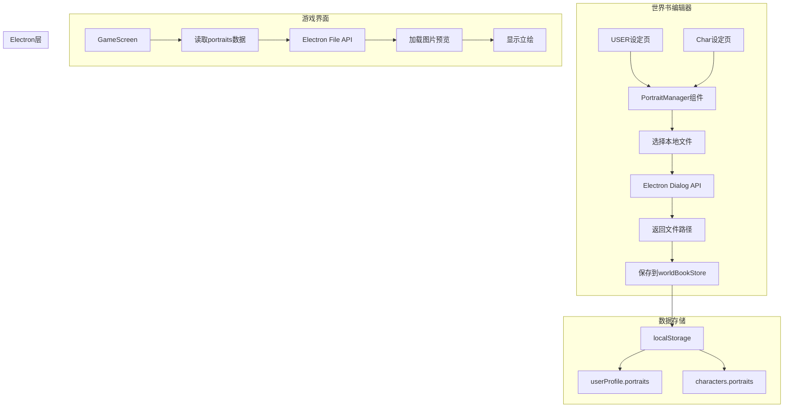

# 世界书立绘配置功能实现计划

## 需求概述

在世界书的 USER 设定页和 Char 设定页中新增立绘配置项，支持：
- 通过本地文件选择加载立绘图片
- 支持多张立绘（不同表情/姿态）
- 在 GameScreen 中显示立绘替代现有剪影
- 提供预览和删除功能
- 使用 Electron 文件路径存储

## 数据结构设计

### 立绘数据模型

```typescript
// 单个立绘配置
interface Portrait {
  id: string           // 唯一标识符
  label: string        // 标签（如：默认、开心、生气等）
  emotion: string      // 表情类型标识符（用于程序匹配）
  filePath: string     // 本地文件路径
  fileName: string     // 原始文件名
  addedAt: string      // 添加时间 ISO 格式
}

// 预设表情类型
interface EmotionPreset {
  id: string           // 表情标识符
  label: string        // 显示名称
  description: string  // 描述说明
}

// USER 设定中的立绘配置
interface UserProfile {
  name: string
  nickname: string
  appearance: string
  identity: string
  background: string
  portraits: Portrait[]  // 新增：立绘列表
}

// Character 设定中的立绘配置
interface Character {
  id: string
  name: string
  nickname: string
  appearance: string
  identity: string
  background: string
  notes: string
  portraits: Portrait[]  // 新增：立绘列表
  createdAt: string
  updatedAt: string
}
```

### 预设表情类型列表

```javascript
// src/worldbook/emotionPresets.js
export const EMOTION_PRESETS = [
  { id: 'default', label: '默认', description: '常规状态，无特殊表情' },
  { id: 'happy', label: '开心', description: '高兴、喜悦、微笑' },
  { id: 'angry', label: '生气', description: '愤怒、不满、恼火' },
  { id: 'sad', label: '悲伤', description: '难过、伤心、忧郁' },
  { id: 'surprised', label: '惊讶', description: '吃惊、意外、震惊' },
  { id: 'fear', label: '恐惧', description: '害怕、紧张、不安' },
  { id: 'disgust', label: '厌恶', description: '反感、嫌弃、不屑' },
  { id: 'neutral', label: '平静', description: '冷静、淡然、无表情' },
  { id: 'shy', label: '害羞', description: '腼腆、不好意思、脸红' },
  { id: 'thinking', label: '思考', description: '沉思、疑惑、考虑中' },
  { id: 'sleepy', label: '困倦', description: '疲惫、想睡、打哈欠' },
  { id: 'excited', label: '兴奋', description: '激动、期待、热血沸腾' },
  { id: 'worried', label: '担心', description: '忧虑、焦虑、不安' },
  { id: 'confident', label: '自信', description: '胸有成竹、从容、坚定' },
  { id: 'custom', label: '自定义', description: '用户自定义表情标签' },
]
```

### 示例数据

```json
{
  "id": "portrait_1712127600000_0",
  "label": "开心",
  "emotion": "happy",
  "filePath": "E:/images/character_happy.png",
  "fileName": "character_happy.png",
  "addedAt": "2024-04-03T10:00:00.000Z"
}
```

## 实现步骤

### 步骤 1: 扩展 Electron IPC 通信

**文件**: `electron/main.js`

添加以下 IPC 处理器：

```javascript
// 文件选择对话框
ipcMain.handle('dialog:select-portrait', async (event, options) => {
  const result = await dialog.showOpenDialog(mainWindow, {
    properties: ['openFile'],
    filters: [
      { name: 'Images', extensions: ['jpg', 'jpeg', 'png', 'gif', 'webp'] }
    ],
    ...options
  })
  return result
})

// 读取图片文件为 Base64（用于预览）
ipcMain.handle('file:read-image', async (event, filePath) => {
  // 验证路径安全性
  // 读取文件并返回 base64 数据
})
```

**文件**: `electron/preload.cjs`

扩展 bridge API：

```javascript
const bridgeApi = {
  display: { ... },
  dialog: {
    selectPortrait: () => ipcRenderer.invoke('dialog:select-portrait'),
  },
  file: {
    readImage: (filePath) => ipcRenderer.invoke('file:read-image', filePath),
  },
}
```

### 步骤 2: 更新 worldBookStore.js

**文件**: `src/worldbook/worldBookStore.js`

修改数据结构：

```javascript
// 创建空立绘数组
export const createEmptyPortraits = () => []

// 创建新立绘配置
export const createNewPortrait = (filePath, fileName, emotion = 'default') => {
  const preset = EMOTION_PRESETS.find(p => p.id === emotion)
  return {
    id: `portrait_${Date.now()}_${Math.random().toString(36).slice(2, 6)}`,
    label: preset?.label || '默认',
    emotion: emotion,
    filePath,
    fileName,
    addedAt: new Date().toISOString(),
  }
}

// 更新 createEmptyUserProfile
export const createEmptyUserProfile = () => ({
  name: '',
  nickname: '',
  appearance: '',
  identity: '',
  background: '',
  portraits: [],  // 新增
})

// 更新 createCharacterSkeleton
export const createCharacterSkeleton = (index = 1) => ({
  id: `char_${Date.now()}_${index}`,
  name: `角色 ${index}`,
  nickname: '',
  appearance: '',
  identity: '',
  background: '',
  notes: '',
  portraits: [],  // 新增
  createdAt: new Date().toISOString(),
  updatedAt: new Date().toISOString(),
})

// 添加立绘规范化函数
const normalizePortrait = (rawPortrait) => {
  return {
    id: String(rawPortrait?.id || `portrait_${Date.now()}`),
    label: String(rawPortrait?.label || '默认'),
    emotion: String(rawPortrait?.emotion || 'default'),
    filePath: String(rawPortrait?.filePath || ''),
    fileName: String(rawPortrait?.fileName || ''),
    addedAt: String(rawPortrait?.addedAt || new Date().toISOString()),
  }
}

// 更新 normalizeUserProfile 和 normalizeCharacter
// 添加 portraits 数组的规范化处理
```

### 步骤 3: 创建立绘管理组件

**新文件**: `src/components/PortraitManager.vue`

组件功能：
- 显示当前立绘列表（缩略图 + 表情标签）
- 添加立绘按钮（调用 Electron 文件选择）
- 表情类型选择（下拉菜单，支持预设表情）
- 自定义表情名称输入（当选择"自定义"时）
- 预览立绘（点击放大查看）
- 删除立绘（确认后移除）
- 编辑立绘表情标签

```vue
<template>
  <div class="portrait-manager">
    <div class="portrait-list">
      <div v-for="portrait in portraits" :key="portrait.id" class="portrait-item">
        
        <div class="portrait-info">
          <select v-model="portrait.emotion" @change="updatePortraitLabel(portrait)">
            <option v-for="preset in EMOTION_PRESETS" :key="preset.id" :value="preset.id">
              {{ preset.label }}
            </option>
          </select>
          <input v-if="portrait.emotion === 'custom'" v-model="portrait.label" type="text" placeholder="自定义表情名称" />
          <span v-else class="portrait-label">{{ portrait.label }}</span>
        </div>
        <button class="remove-btn" @click="removePortrait(portrait.id)">删除</button>
      </div>
    </div>
    <button class="add-portrait" @click="addPortrait">+ 添加立绘</button>
    
    <!-- 预览弹窗 -->
    <div v-if="previewPortrait" class="portrait-preview-modal" @click="closePreview">
      
    </div>
  </div>
</template>

<script setup>
import { ref } from 'vue'
import { EMOTION_PRESETS } from '../worldbook/emotionPresets'

const props = defineProps({
  portraits: { type: Array, default: () => [] }
})

const emit = defineEmits(['update'])

const previewPortrait = ref(null)

// 获取立绘预览 URL（通过 Electron API）
const portraitPreview = async (portrait) => {
  if (!window.avgLLM?.file?.readImage) return ''
  const base64 = await window.avgLLM.file.readImage(portrait.filePath)
  return `data:image;base64,${base64}`
}

// 添加立绘
const addPortrait = async () => {
  if (!window.avgLLM?.dialog?.selectPortrait) return
  const result = await window.avgLLM.dialog.selectPortrait()
  if (result.canceled || result.filePaths.length === 0) return
  
  const filePath = result.filePaths[0]
  const fileName = filePath.split(/[\\/]/).pop()
  const newPortrait = createNewPortrait(filePath, fileName, 'default')
  
  emit('update', [...props.portraits, newPortrait])
}

// 更新立绘标签
const updatePortraitLabel = (portrait) => {
  const preset = EMOTION_PRESETS.find(p => p.id === portrait.emotion)
  portrait.label = preset?.label || portrait.label
  emit('update', [...props.portraits])
}

// 删除立绘
const removePortrait = (id) => {
  emit('update', props.portraits.filter(p => p.id !== id))
}

// 预览相关
const showPreview = (portrait) => { previewPortrait.value = portrait }
const closePreview = () => { previewPortrait.value = null }
</script>
```

### 步骤 4: 更新 WorldBookEditorScreen.vue

在 USER 设定页和 Char 设定页中添加立绘配置区域：

**USER 设定页**（约第 250-314 行）：
```vue
<!-- 在现有字段后添加 -->
<div class="setting-field">
  <span class="setting-label">立绘配置</span>
  <PortraitManager
    :portraits="activeBook?.userProfile?.portraits || []"
    @update="updateUserField('portraits', $event)"
  />
</div>
```

**Char 设定页**（约第 335-410 行）：
```vue
<!-- 在现有字段后添加 -->
<div class="setting-field">
  <span class="setting-label">立绘配置</span>
  <PortraitManager
    :portraits="activeCharacter?.portraits || []"
    @update="updateActiveCharacterField('portraits', $event)"
  />
</div>
```

### 步骤 5: 更新 GameScreen.vue - 情绪匹配立绘显示

修改角色显示逻辑，根据对话情绪自动匹配立绘：

#### 5.1 对话数据结构扩展

对话脚本需要包含情绪标记：

```javascript
const dialogueScript = [
  {
    speaker: '旁白',
    text: '雨夜的图书馆只剩你与断续的电流声...',
    emotion: null,  // 旁白不需要情绪
  },
  {
    speaker: '伊芙',
    text: '终于等到你了，档案室的门只会在今晚开启...',
    emotion: 'happy',  // 情绪标识符
  },
  {
    speaker: '你',
    text: '我来找失踪案的原始记录...',
    emotion: 'neutral',
  },
  {
    speaker: '零号',
    text: '再往前一步，你会看到不该被公开的名字...',
    emotion: 'worried',
  },
]
```

#### 5.2 立绘匹配逻辑

```vue
<script setup>
import { computed, ref, watch } from 'vue'
import { loadWorldBooks, getActiveWorldBookId } from '../worldbook/worldBookStore'

// 加载世界书数据
const worldBooks = ref([])
const activeBookId = ref(getActiveWorldBookId())

const loadWorldBookData = () => {
  worldBooks.value = loadWorldBooks()
}

// 根据角色ID和情绪获取对应立绘
const getCharacterPortrait = (characterId, emotion = 'default') => {
  const book = worldBooks.value.find(b => b.id === activeBookId.value)
  if (!book) return null
  
  // 查找角色（支持 USER 和 Char）
  let character = null
  if (characterId === 'user' || characterId === 'lead') {
    character = book.userProfile
  } else {
    character = book.characters.find(c => c.id === characterId)
  }
  
  if (!character?.portraits?.length) return null
  
  // 按情绪匹配立绘
  const matchedPortrait = character.portraits.find(p => p.emotion === emotion)
  if (matchedPortrait) return matchedPortrait
  
  // 回退到默认立绘
  const defaultPortrait = character.portraits.find(p => p.emotion === 'default')
  if (defaultPortrait) return defaultPortrait
  
  // 使用第一个立绘作为最终回退
  return character.portraits[0]
}

// 获取立绘预览 URL
const getPortraitUrl = async (portrait) => {
  if (!portrait?.filePath || !window.avgLLM?.file?.readImage) return ''
  const base64 = await window.avgLLM.file.readImage(portrait.filePath)
  return `data:image;base64,${base64}`
}

// 当前对话的情绪
const currentEmotion = computed(() => currentLine.value?.emotion || 'default')

// 当前说话角色的立绘
const currentSpeakerPortrait = computed(() => {
  const characterId = speakerCharacterMap[currentLine.value?.speaker]
  return getCharacterPortrait(characterId, currentEmotion.value)
})

onMounted(loadWorldBookData)
</script>
```

#### 5.3 模板更新

```vue
<div class="character-layer" aria-label="人物立绘">
  <button
    v-for="character in sceneCharacters"
    :key="character.id"
    type="button"
    class="character-stand"
    :class="[
      character.toneClass,
      character.positionClass,
      { active: activeCharacterId === character.id },
      { speaking: currentLine.speaker === character.name }
    ]"
    @click="activeCharacterId = character.id"
  >
    <!-- 根据情绪匹配立绘 -->
    
    <!-- 否则显示剪影 -->
    <span v-else class="character-silhouette" aria-hidden="true"></span>
    <span class="character-name">{{ character.name }}</span>
  </button>
</div>
```

#### 5.4 情绪显示策略

```javascript
// 获取角色当前应显示的情绪
const getDisplayEmotion = (characterId) => {
  // 当前说话的角色显示对话情绪
  if (activeCharacterId.value === characterId && currentLine.value?.emotion) {
    return currentLine.value.emotion
  }
  // 非说话角色显示默认表情
  return 'default'
}
```

## 架构流程图



## 组件交互图

```mermaid
sequenceDiagram
    participant User as 用户
    participant PM as PortraitManager
    participant Editor as WorldBookEditor
    participant Electron as Electron API
    participant Store as worldBookStore

    User->>PM: 点击添加立绘
    PM->>Electron: dialog.selectPortrait
    Electron->>User: 显示文件选择对话框
    User->>Electron: 选择图片文件
    Electron->>PM: 返回文件路径
    PM->>Store: 保存立绘配置
    Store->>Editor: 更新UI显示

    User->>PM: 点击预览
    PM->>Electron: file.readImage
    Electron->>PM: 返回Base64数据
    PM->>User: 显示预览弹窗

    User->>PM: 点击删除
    PM->>Store: 移除立绘配置
    Store->>Editor: 更新UI显示
```



## 文件修改清单

| 文件路径 | 修改类型 | 说明 |
|---------|---------|------|
| `electron/main.js` | 修改 | 添加 dialog 和 file IPC 处理器 |
| `electron/preload.cjs` | 修改 | 扩展 bridge API |
| `src/worldbook/emotionPresets.js` | 新建 | 预设表情类型定义 |
| `src/worldbook/worldBookStore.js` | 修改 | 添加 portraits 字段和相关函数 |
| `src/components/PortraitManager.vue` | 新建 | 立绘管理组件（含表情选择） |
| `src/screens/WorldBookEditorScreen.vue` | 修改 | 集成立绘管理组件 |
| `src/screens/GameScreen.vue` | 修改 | 显示立绘图片 |

## 样式设计要点

1. **立绘列表布局**: 使用 flex/grid 布局，支持响应式
2. **缩略图尺寸**: 建议 120x120px 或 150x150px
3. **预览弹窗**: 居中显示，支持点击关闭
4. **删除确认**: 使用确认对话框防止误删
5. **拖拽排序**: 可选功能，支持调整立绘顺序

## 注意事项

1. **路径安全**: Electron 端需要验证文件路径的合法性
2. **文件格式**: 限制为常见图片格式 (jpg, png, gif, webp)
3. **文件大小**: 可考虑添加文件大小限制
4. **路径持久性**: 文件移动后路径失效的处理
5. **跨平台兼容**: Windows/macOS/Linux 路径格式差异